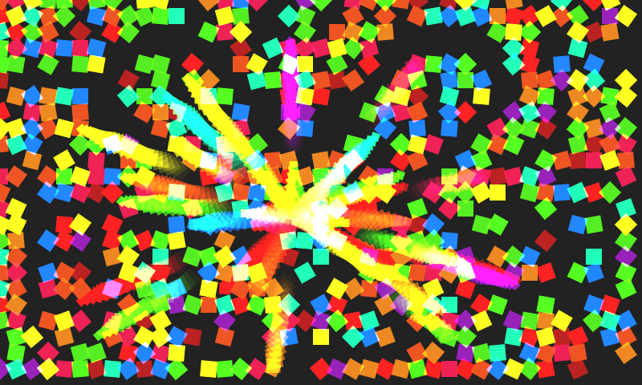
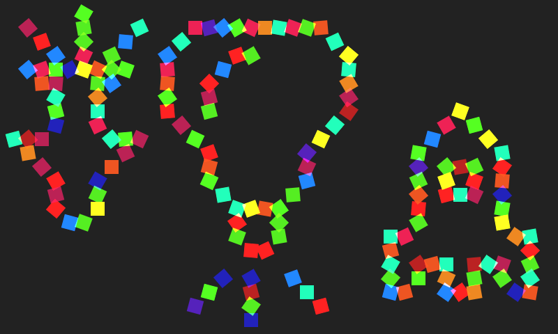
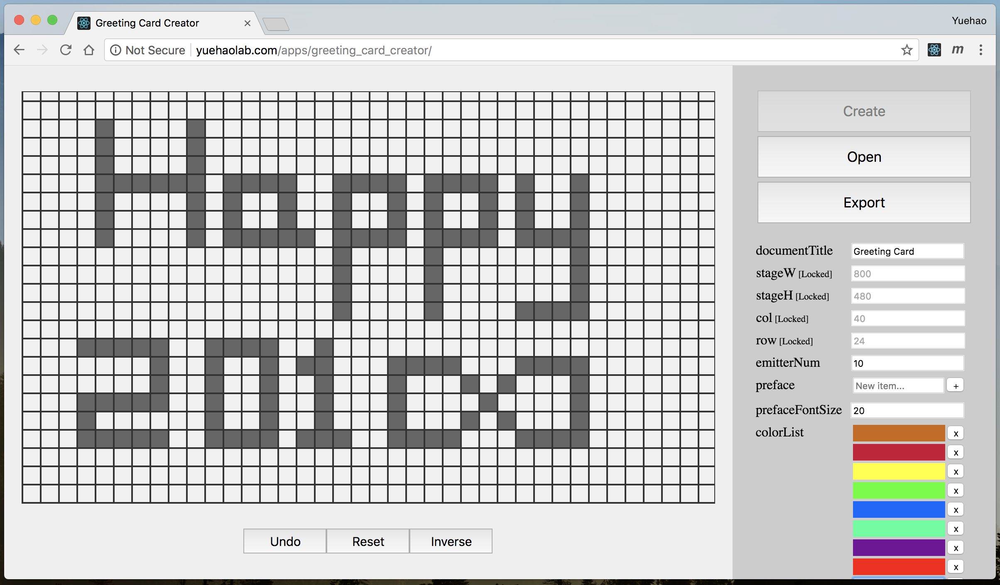

# Greeting Card
---------------

*Your creative, cross-platform and magnificent greeting card.*


## Intro

Be tired of paper greeting card? Get no originality about birthday gift? This project may come to your assistance. To make sure you'll immediately fall in love with it, please enjoy two screenshots below.





You may want to write some warm words to your best friends, parents or lover. Plain text may bore them. *Greeting Card* provides a magnificent animation to show the message brick by brick. Receivers just need to tap the screen until they make sense of what you want to express (maybe it's your gratitude or your love). Two demo are listed below:

- [Happy Birthday to My Grandma](http://yuehaolab.com/demo/greeting_card/?config_file=config2.js)
- [Happy Chinese Valentine's Day](http://yuehaolab.com/demo/greeting_card/)

Being compatible with many popular platforms including main-stream web browsers, QQ and Wechat, your receivers can open and view your greeting card everywhere regardless they are using smart phones or computers. (Lag phenomenon may occur on certain devices, because particle animations are fairly performance hungry.)


## Quick Start

*Greeting Card* provides a shortcut to get your works without coding effort. Follow the instructions below to get started with *Greeting Card*.

### Step1: Setup of *Greeting Card*

[Download the `.zip` package](http://yuehaolab.com/downloads/greeting_card.zip) and unzip it to your computer. Then, you will get a directory like this:

```
+ greeting_card/
|
`---- src/
|
`---- index.html
|
`---- config.js
|
`---- config_default.js
```

Open the `index.html` in your web browser which must support HTML5 and then you'll see the default demo. Tap the demo page until there is no unemitted particle. Now, you have got your first impression of this project.

The `config.js` file is the default entrance to the configuration of *Greeting Card*. If you are familiar with *JavaScript*, you can edit it in a plain-text editor to customize your work. However, it is NOT the recommended way to modify the `config.js` directly because of its poor readability. The best way to get your own greeting card is to generate a configuration file via *Greeting Card Creator* (See Step2).

If it is in your need to create more than one configuration file, you don't have to download and unzip the compressed package again. Just new a `.js` file with the different name from `config.js` (e.g. `config2.js`, `myconfig.js`) in the `greeting_card/` directory. To apply the new configuration file to the `index.html`, you need to add a query string to the url in your browser for specifying which configuration file should be used. For example, if you want to apply the `config2.js` file to your greeting card, change the url from `path/to/greeting_card/index.html` to `path/to/greeting_card/index.html?config_file=config2.js` in your browser.

### Step2: Customization via *Greeting Card Creator*

[*Greeting Card Creator*](http://yuehaolab.com/apps/greeting_card_creator/) is an attached online tool to generate configuration files for simplifying the customization of *Greeting Card*. Open this tool in your web browser and start your creation in an easy way.

This tool is quite easy and convenient to use since you just need to fill out a form (or use the default value) and design your pattern by simple point-and-click operations.

After loading the creator in your web browser, you will get a welcome page. Now there are two choices laid in front of you:

1. Click the 'Create' button to create a grid using the settings from the sidebar's form. Before this operation, you may need to change some settings on the sidebar. Also note, after your click at the 'Create' button, settings on `stageW`, `stageH`, `row` and `col` will be locked (i.e. you CANNOT modify them anymore).
2. Open an existing configuration file suffixed with `.js` (e.g. `config.js`), if any.

No matter which one you choose, you will get a grid on the left side. Do some clicks on the grid and you'll see that the color of the block which you click at turns darkgray. If you click it again, it will turn back to lightgray. One darkgray block indicates there is one paritcle. Lightgray area indicates there is no particle. The 'Undo', 'Inverse' and 'Reset' button will come to your assitance if you want to cancel the previous opertions, inverse area's color and discard the creation, respectively.



*(Basic user interface of *Greeting Card Creator*)*

When you finish your creation, you can click the 'Export' button to get the content of the configuration file. Then, copy and save the text from the 'Export Result' textbox to a vacant `.js` file. Next time, you can improve your previous work by opening this configuration file.

### Step3: Publish Your Works

- If you have your own server, you can publish your greeting cards as static webpages.

- [Github Pages](https://pages.github.com/) is recommended for publishing your greeting cards.

- Nevertheless, if you get nowhere to upload your works but you really need to share them, don't hesitate and drop me an email with your configuration files. I will send back the urls which direct to the works to you. I'm willing to help you out. **Note: I am NOT sure that I will upload your works in time. So please send to me as early as possible.**


## Developer Guide

If you are interested in this project and want to get involved, this developer guide is worth reading for you.

First, clone this project:

```shell
git clone https://github.com/yuehaowang/greeting_card.git
```

Files in `src/` implement the web user interface of *Greeting Card*. Therefore, if you want to enhance the user interface, you need to review the code in `src/` so that you can add your own code at a right place.

The `config.js` and `config_default.js` are two files for customization (the latter one is used for providing default value for those options where the former one doesn't give a value). Hence if you want to add some options, you need to modify both `config.js` file and `config_default.js` file. Correspondingly, you need to modify a constant named `defaultConfig` in `creator/src/Sidebar.js` to make the creator adapt to your modification.

*Greeting Card Creator* is powered by [React](https://reactjs.org) and built with [create-react-app](https://www.npmjs.com/package/create-react-app) and [NodeJs](http://nodejs.org/). You probably need to learn about all of them before you try to edit the source code. Simply put, to run the creator locally, type this command:

```shell
npm start
```

To build the creator, type this command:

```shell
npm run build
```

If you want to contribute to this project after finishing your improvements, you can submit a pull request to this repo. I will merge it and be grateful to you if I find your commits helpful.


## Troubleshooting

If you come across any problems, please let me know ~

> Email: wangyuehao1999@gmail.com

Alternatively, you can submit an issue to describe your problems.

Suggestions and comments are welcomed as well.


## License 

[MIT License](http://en.wikipedia.org/wiki/MIT_License)
